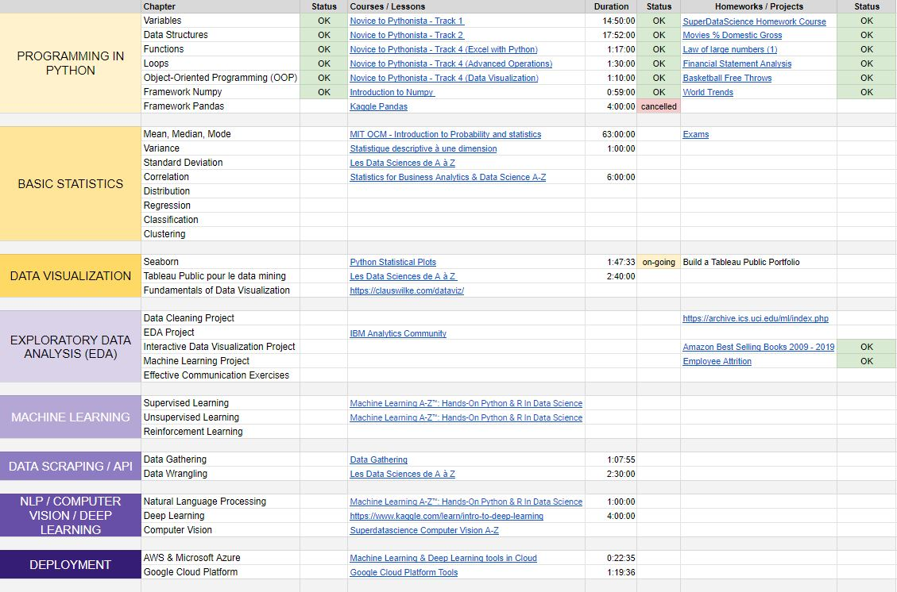

# The Conclusion of this challenge 

This last day is about the conclusion I took from this 20 days data science challenge 2021. As the end of the year is coming, what a better time for retrospection. This entry is about my approach and motivation. Maybe it can be helpful to someone struggling to start a similar path.  

I started this journey out of curiosity for Data Science.  
The main questions in my head were:

- What is the difference between Data Analysis and Data Science? 
- What is the tech stack required for Data Science?
- What are the daily tasks of a data scientist? 
- What kind of project do you do as a data scientist? 
- How can I be more productive during this lockdown period?  

My challenge revolved around learning something new each day and going behind the scene of the Data Science trend.  
Firstly, it leads me to how to learn Data Science.  
 
## PART 1: THE HOMEMADE LEARNING PROGRAM   

It's such a vast subject with a lot of resources and materials. As a beginner, I felt lost and overwhelmed by the quantity of information available.  

Being a visual learner, I needed support to not get lost along the way. Something to rely on when procrastination wants to kick in. Something to track my progress as well. *But how do I build such a thing?*  
I used Tina Huang, Ken Jee videos as a starting point. [How to learn data science in 2021](https://www.youtube.com/watch?v=Axu4tJl8gbM&t=12s) and [How I would learn data science if I had to start over](https://www.youtube.com/watch?v=4OZip0cgOho) gave me the focus to build a tailored program. After identifying the main chapters, I looked for lessons and projects to associate with each one. My advice is: capitalize as much as possible on what you already have. In my case, my company provided a premium account to the learning platform Skillsoft Percipio. I found many lessons there. They even deliver completion badges after completion. For missing topics, I chose Udemy because you can buy a lot of Data Science Courses at a discounted price. I fell in love with the courses delivered by [SuperDataScience](https://www.superdatascience.com/). Having diverse resources (I would recommend having less than 5) is a good thing for a learning brain. I felt like a member of the Data Science community and I was completely immersed in each chapter. It also killed the boredom and the monotony (learning on the same platform each day can feel boring). But the important part is to stick to your selection. Don't waste time doubting your own choice afterward (trust yourself). The last element of my learning program was the Bonus part. Where I added additional links and resources for reading time outside my learning schedule. These lectures were meant to keep my interest in Data Science alive. I selected easier materials to consume because you don't want to end up burnt out. 

My challenge per se didn't even start at this point but it was important for me to have a roadmap. Crushing a big task into smaller steps makes the journey more simple and actionable. Here is the result of this first step. I left this file opened on my computer during the entire challenge. I even read it multiple times a day and adjusted it along the way. You should be absolutely comfortable with your roadmap. Things don't always go as planned so it's ok to adapt. 

**My key points to make your syllabus:**

1. Learn how to learn your targeted subject from the experts.
2. Capitalize on what you already have.
3. Choose no more than 5 resources among all available and stick to your selection. 
4. Make small actionable steps in your program. 
5. Add bonuses material to read outside your learning schedule for cooling down.

It is important to mention that I didn't design the program for completion. I designed it to learn knew things daily and build the habit of doing so. It was also a good activity to keep my mind busy during lockdown.  

## PART 2: THE DAY BY DAY STRUGGLES 
  
I explain how I designed my environment to optimize studying.

After working almost one year non-stop, I took all my days off so that I could dedicate my entire day to this challenge. To get the right momentum, I used [Merve](https://www.youtube.com/channel/UCkPgEucgqedbckpzC2EUwIA) and [StudyMD](https://www.youtube.com/c/StudyMD?app=desktop) videos. They follow the POMODORO cycle and can do long study sessions. 

At the beginning of a study session, I would create a Google docs file and separate it into two parts. In the header, I make a short of the lessons and exercises for the day (please choose only a few. Stay reasonable). 

In the second part, I added the code produced. My working environment was set up beforehand. I highly recommend your environment be ready before starting a technical challenge. Installation and configuration problems can be irritating and you still have a long way to go after.

When I finish a task, I happily cross it off my list and move on to the next. Doing so gives me a feeling of satisfaction. Also, you can easily focus on the smaller subset rather than on the syllabus. Sometimes I didn't want to continue (even during the lockdown, life gets in the way somehow). All the commits are not right after one another. The largest gap is the release of this last day but it doesn't bother me. I'm happy to provide closure to this challenge. 

I also learn that being not perfect is ok. I stopped expecting perfection out of this challenge when the first gap appeared. The most important thing is to continue, to keep going. Even when I wasn't in a learning session, I was reading or discovering content about Data Science. It encouraged me to come back. As you learn more and more about a subject, it also loses a little bit of this magic effect. When I was looking at Data Science from the outside, the topic looked fancier. But when you are an insider, your vision changes. One just got to accept that reality. We learn to uncover the truth and dismiss the mystery. 

**My key lessons from this challenge:**  

1. Optimize your environment for learning and focusing.
2. Focus on a small achievable list of tasks.
3. Don't look for perfection. 
4. Keep going.   

## PART 3: WHAT'S NEXT?  

I encourage you to learn something outside your comfort zone. When you tackle unknown subjects daily, it strengthens your capacities. Now I can study more longer. This challenge also killed laziness and made me proud of publishing my work. Even if it's not perfect, it shows how committed I am to what I deliver. How much investment I'm putting into a subject. Finally, this journey gave me the courage to pursue new opportunities no matter the circumstances. 

**My last conclusion: Be proud of your current work and continue your journey.**  

Thank you. 

 
 

 
 
